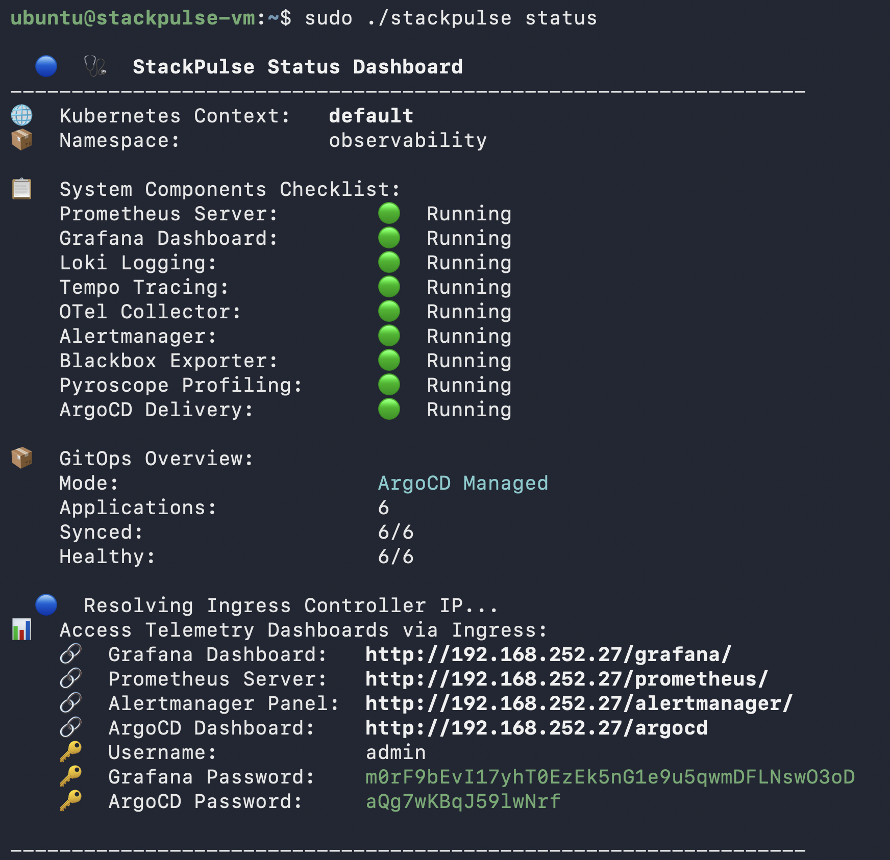
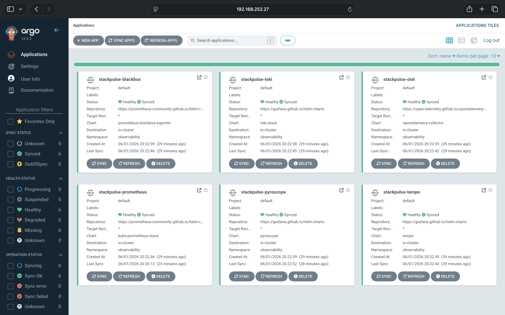
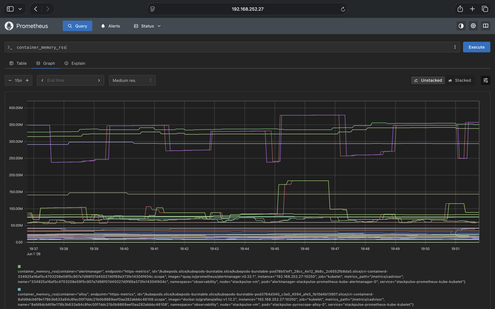
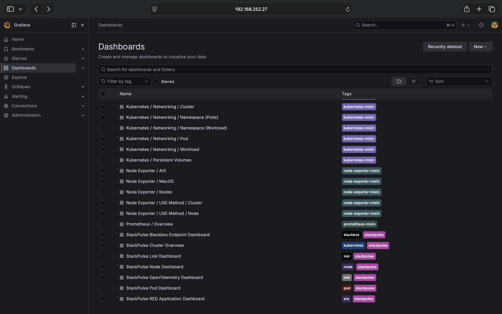
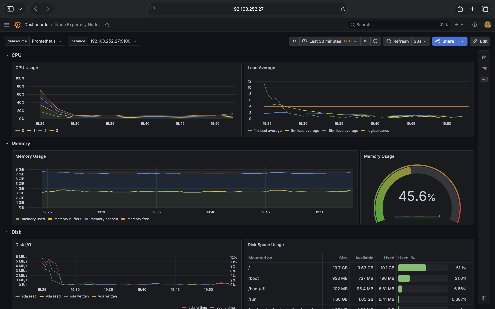
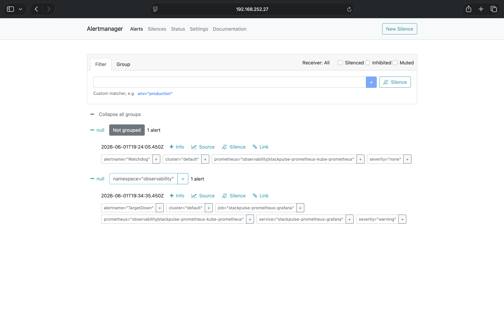

<div align="center">

# ☁️🤖 CloudInferOps

### Multi-Cloud AI Inference Operations CLI

**CloudInferOps** is a production-grade Go and Python platform for deploying,
monitoring, benchmarking, and operating LLM inference workloads on Kubernetes
across local, VM, and cloud environments.

It combines a Go-based infrastructure control plane with a Python FastAPI
inference gateway, giving platform engineers a single CLI to bootstrap
Kubernetes, deploy AI inference services, install observability, run benchmarks,
manage GitOps, and inspect reliability signals.

<br />

[](https://github.com/shivamshashank/cloud-infer-ops/actions/workflows/ci.yml)
[](https://github.com/shivamshashank/cloud-infer-ops/releases)
[](LICENSE)
[](https://goreportcard.com/report/github.com/shivamshashank/cloud-infer-ops)

<br />


<br />

[Overview](#-overview) • [Architecture](#-architecture) •
[Quick Start](#-quick-start) • [CLI](#-cli-commands) •
[Observability](#-ai-observability) • [Benchmarking](#-benchmarking) •
[Benefits](#-benefits)

</div>

---

## 📌 Overview

CloudInferOps turns a Kubernetes-compatible environment into a complete AI
inference operations platform.

With one CLI, you can:

- Detect whether the machine is ready for Kubernetes and AI workloads.
- Bootstrap a local Kubernetes cluster with kind, minikube, or k3s when needed.
- Deploy a production-style observability stack.
- Deploy an LLM inference gateway backed by Ollama or vLLM.
- Expose OpenAI-compatible chat completion APIs.
- Route requests across models and providers.
- Measure AI-specific signals such as TTFT, tokens/sec, model usage, and P95
  latency.
- Run benchmark workloads and generate latency, throughput, and cost reports.
- Manage GitOps delivery through ArgoCD.
- Send alerts and incidents to Slack, PagerDuty, and webhook consumers.
- Inspect the full platform from a single status command.

CloudInferOps is designed for AI infrastructure engineers, MLOps engineers,
platform engineers, SREs, and backend engineers who need a realistic way to
deploy and operate LLM systems rather than only call an external API.

---

## 🎯 What Problem It Solves

Running LLMs in production is not just model serving. Teams also need:

- Kubernetes deployment and lifecycle management.
- Reliable routing between models and inference backends.
- AI-aware observability beyond generic HTTP metrics.
- Benchmarking before choosing models and infrastructure.
- Autoscaling and failure visibility.
- GitOps workflows for repeatable platform deployment.
- Cost and performance signals for engineering decisions.

CloudInferOps brings these concerns into one project:

```text
Deploy LLMs. Observe tokens. Benchmark latency. Operate AI workloads on Kubernetes.
```

---

## ✨ Core Features

### ☁️ Multi-Cloud And Local Kubernetes

- Existing Kubernetes cluster support.
- Local cluster bootstrap with kind, minikube, or k3s.
- Linux VM support for AWS EC2, GCP Compute Engine, and Azure VM style
  deployments.
- AWS EKS-ready deployment structure.
- Environment-aware checks for CPU, memory, disk, ports, tools, ingress, and
  storage.

### 🤖 LLM Inference Platform

- FastAPI inference gateway.
- OpenAI-compatible `/v1/chat/completions` endpoint.
- Ollama provider for local CPU-friendly demos.
- vLLM provider path for GPU-backed production inference.
- Model routing layer for chat, coding, reasoning, and fallback workloads.
- Streaming and non-streaming response support.
- Provider timeouts, retries, and backend health checks.

### 📊 AI Observability

- Prometheus metrics for inference requests, errors, latency, tokens, and model
  usage.
- Grafana dashboards for LLM health and performance.
- OpenTelemetry tracing across gateway, router, and inference backend.
- Loki logs and Tempo traces.
- Alertmanager rules for high latency, high error rate, low throughput, and
  backend downtime.

### 📈 Benchmarking

- CLI-driven benchmark runner.
- P50, P95, and P99 latency reports.
- Time to first token measurement.
- Tokens/sec and requests/sec.
- Error rate and backend availability.
- Estimated cost/request reporting.
- JSON, Markdown, and HTML report outputs.

### 🔁 GitOps And Platform Operations

- ArgoCD bootstrap.
- GitOps-managed platform, observability, and inference workloads.
- Application sync and health status.
- Helm-based deployment engine.
- Dry-run support for safe review before applying resources.

### 🚨 Reliability And Incident Workflows

- Slack and PagerDuty integration.
- Alertmanager webhook handler.
- Recent incident API.
- SLO-focused alerts.
- Kubernetes readiness and liveness probes.
- Failure and recovery demo support.

### 🔐 Security And Readiness

- Kubernetes manifest checks.
- Privileged container detection.
- Resource request and limit validation.
- `latest` image tag warnings.
- Public ingress exposure checks.
- Optional Trivy and kube-score integrations.

---

## 🧱 Tech Stack

| Layer             | Technologies                                                      |
| ----------------- | ----------------------------------------------------------------- |
| CLI Control Plane | Go, Cobra, Viper                                                  |
| Inference Gateway | Python, FastAPI, Pydantic, Uvicorn                                |
| LLM Providers     | Ollama, vLLM, OpenAI-compatible APIs                              |
| Containers        | Docker                                                            |
| Orchestration     | Kubernetes, kind, minikube, k3s                                   |
| Deployment        | Helm, Kubernetes manifests                                        |
| GitOps            | ArgoCD                                                            |
| Metrics           | Prometheus, kube-state-metrics, Node Exporter                     |
| Dashboards        | Grafana                                                           |
| Logs              | Loki, Grafana Alloy / Promtail                                    |
| Traces            | Tempo, OpenTelemetry Collector                                    |
| Alerts            | Alertmanager, Slack, PagerDuty                                    |
| Benchmarking      | Go CLI runner, Python load scenarios, JSON/Markdown/HTML reports  |
| CI/CD             | GitHub Actions, Docker image builds, release binaries             |
| Cloud Targets     | Local Kubernetes, Linux VMs, AWS EC2/k3s, AWS EKS-ready structure |

---

## 🏗️ Architecture

```text
                            ┌────────────────────────────┐
                            │      cloudinferops CLI     │
                            │        Go Control Plane    │
                            └──────────────┬─────────────┘
                                           │
        ┌──────────────────────────────────┼──────────────────────────────────┐
        │                                  │                                  │
┌───────▼────────┐              ┌──────────▼──────────┐            ┌──────────▼──────────┐
│ Doctor Checks  │              │ Kubernetes Platform │            │ GitOps / ArgoCD     │
│ OS, tools, GPU │              │ kind, k3s, EKS      │            │ Sync and health     │
└───────┬────────┘              └──────────┬──────────┘            └──────────┬──────────┘
        │                                  │                                  │
        └──────────────────────────────────▼──────────────────────────────────┘
                                           │
                                ┌──────────▼──────────┐
                                │  Kubernetes Cluster │
                                └──────────┬──────────┘
                                           │
      ┌────────────────────────────────────┼────────────────────────────────────┐
      │                                    │                                    │
┌─────▼─────┐                    ┌─────────▼─────────┐                  ┌───────▼───────┐
│ Platform  │                    │ Inference Gateway │                  │ Observability │
│ Services  │                    │ Python FastAPI    │                  │ Stack         │
└─────┬─────┘                    └─────────┬─────────┘                  └───────┬───────┘
      │                                    │                                    │
      │                         ┌──────────▼──────────┐                         │
      │                         │     Model Router    │                         │
      │                         └──────────┬──────────┘                         │
      │                                    │                                    │
      │                  ┌─────────────────┴─────────────────┐                  │
      │                  │                                   │                  │
┌─────▼──────┐   ┌───────▼────────┐                 ┌────────▼───────┐   ┌──────▼──────┐
│ Ingress    │   │ Ollama Backend │                 │ vLLM Backend   │   │ Prometheus  │
│ Controller │   │ Local LLMs     │                 │ GPU Inference  │   │ Grafana     │
└────────────┘   └────────────────┘                 └────────────────┘   │ Loki Tempo  │
                                                                         │ Alertmanager│
                                                                         └─────────────┘
```

---

## 🔄 End-To-End Request Flow

```text
User or application
  -> POST /v1/chat/completions
  -> FastAPI inference gateway
  -> request validation
  -> model router
  -> Ollama or vLLM provider
  -> streamed or JSON response
  -> Prometheus metrics emitted
  -> OpenTelemetry trace exported
  -> logs collected by Loki
  -> Grafana dashboards updated
  -> Alertmanager triggers incidents if SLOs fail
```

---

## ⚡ Quick Start

### 1. Install CloudInferOps

```bash
curl -sSL https://raw.githubusercontent.com/shivamshashank/cloud-infer-ops/main/scripts/install.sh | bash
```

Verify installation:

```bash
cloudinferops version
```

### 2. Check Environment Readiness

```bash
sudo cloudinferops doctor
```

Example:

```text
CloudInferOps Doctor

[OK] OS: linux/amd64
[OK] Internet connection
[OK] Docker found
[OK] kubectl found
[OK] Helm found
[OK] Kubernetes cluster detected
[OK] StorageClass found
[INFO] GPU not detected; Ollama local inference path available

[READY] Run: sudo cloudinferops deploy platform
```

### 3. Deploy Platform Observability

```bash
sudo cloudinferops deploy platform
```

This deploys:

- NGINX ingress controller.
- Prometheus.
- Grafana.
- Loki.
- Tempo.
- OpenTelemetry Collector.
- Alertmanager.
- ArgoCD.
- Node Exporter.
- kube-state-metrics.
- AI and Kubernetes dashboards.
- SLO and inference alert rules.

### 4. Deploy LLM Inference

Local Ollama path:

```bash
sudo cloudinferops deploy inference --provider ollama --model llama3
```

GPU vLLM path:

```bash
sudo cloudinferops deploy inference --provider vllm --model mistral --gpu
```

### 5. Send A Chat Request

```bash
curl -X POST http://cloudinferops.local/v1/chat/completions \
  -H "Content-Type: application/json" \
  -d '{
    "model": "llama3",
    "messages": [
      {
        "role": "user",
        "content": "Explain Kubernetes in simple terms."
      }
    ]
  }'
```

### 6. Check Platform Status

```bash
sudo cloudinferops status
```

Example:

```text
CloudInferOps Status
-----------------------------------------------------------------
Kubernetes Context:        kind-cloudinferops
Platform Namespace:        observability
Inference Namespace:       inference

Platform Components:
  Prometheus:              Running
  Grafana:                 Running
  Loki:                    Running
  Tempo:                   Running
  OpenTelemetry:           Running
  Alertmanager:            Running
  ArgoCD:                  Healthy

Inference Components:
  Gateway:                 Healthy
  Provider:                ollama
  Active model:            llama3
  Average latency:         420ms
  P95 latency:             890ms
  Tokens/sec:              128
  Error rate:              0.2%

Dashboards:
  Grafana:                 http://cloudinferops.local/grafana
  Prometheus:              http://cloudinferops.local/prometheus
  ArgoCD:                  http://cloudinferops.local/argocd
```

### 7. Run A Benchmark

```bash
cloudinferops benchmark run --model llama3 --requests 100 --concurrency 10
cloudinferops benchmark report --latest
```

---

## 🧰 CLI Commands

### General

```bash
cloudinferops version
sudo cloudinferops init
sudo cloudinferops doctor
sudo cloudinferops status
```

### Platform

```bash
sudo cloudinferops deploy platform
sudo cloudinferops deploy platform --dry-run
sudo cloudinferops deploy platform --ha
sudo cloudinferops connect grafana
sudo cloudinferops connect prometheus
sudo cloudinferops connect argocd
```

### Inference

```bash
sudo cloudinferops deploy inference --provider ollama --model llama3
sudo cloudinferops deploy inference --provider vllm --model mistral --gpu
sudo cloudinferops deploy inference --dry-run
cloudinferops models list
cloudinferops models pull llama3
cloudinferops models health
```

### Benchmarking

```bash
cloudinferops benchmark run --model llama3 --requests 100 --concurrency 10
cloudinferops benchmark run --scenario benchmarking/scenarios/chat.yaml
cloudinferops benchmark report --latest
cloudinferops benchmark report --format html
```

### Observability

```bash
sudo cloudinferops dashboards import
sudo cloudinferops logs
sudo cloudinferops logs --component gateway
sudo cloudinferops logs --component ollama
sudo cloudinferops logs --component prometheus
sudo cloudinferops logs --component grafana
```

### GitOps

```bash
sudo cloudinferops gitops bootstrap
sudo cloudinferops gitops bootstrap --with-inference
sudo cloudinferops gitops bootstrap --dry-run
sudo cloudinferops gitops status
```

### Alerts And Incidents

```bash
sudo cloudinferops alerts configure --slack
sudo cloudinferops alerts configure --pagerduty
sudo cloudinferops alerts test
sudo cloudinferops deploy webhook-handler
cloudinferops incidents list
```

### Security

```bash
sudo cloudinferops security scan
sudo cloudinferops security scan --namespace inference
sudo cloudinferops security report --json
```

### Cleanup

```bash
sudo cloudinferops uninstall inference
sudo cloudinferops uninstall platform
sudo cloudinferops uninstall all
```

---

## ⚙️ Configuration

CloudInferOps stores local configuration at:

```text
~/.cloudinferops/config.yaml
```

Example:

```yaml
namespace: observability

kubernetes:
  type: auto
  kubeconfig: ~/.kube/config

inference:
  namespace: inference
  provider: ollama
  model: llama3
  gateway:
    replicas: 2
    image: ghcr.io/shivamshashank/cloudinferops-gateway:latest
    servicePort: 8000
  ollama:
    enabled: true
    url: http://cloudinferops-ollama.inference.svc.cluster.local:11434
  vllm:
    enabled: false
    image: vllm/vllm-openai:latest
    gpu: true
    tensorParallelSize: 1
  routing:
    default: llama3
    rules:
      coding: deepseek-coder
      chat: llama3
      reasoning: mistral

observability:
  prometheus: true
  grafana: true
  loki: true
  tempo: true
  alertmanager: true
  opentelemetry: true
  nodeExporter: true
  kubeStateMetrics: true
  logCollector: alloy
  blackboxExporter: true
  pyroscope: true
  thanos: false

benchmarking:
  defaultRequests: 100
  defaultConcurrency: 10
  reportFormats:
    - json
    - markdown
    - html

alerts:
  slack:
    enabled: false
    webhookUrlSecret: cloudinferops-slack-webhook
  pagerduty:
    enabled: false
    integrationKeySecret: cloudinferops-pagerduty-key
```

---

## 🤖 Inference API

### Health

```http
GET /health
```

Response:

```json
{
  "status": "healthy",
  "provider": "ollama",
  "model": "llama3"
}
```

### Models

```http
GET /models
```

Response:

```json
{
  "models": [
    {
      "name": "llama3",
      "provider": "ollama",
      "status": "ready"
    }
  ]
}
```

### Chat Completions

```http
POST /v1/chat/completions
```

Request:

```json
{
  "model": "llama3",
  "messages": [
    {
      "role": "user",
      "content": "Give me a Kubernetes readiness checklist."
    }
  ],
  "stream": false
}
```

### Metrics

```http
GET /metrics
```

Exposes:

```text
cloudinferops_inference_requests_total
cloudinferops_inference_errors_total
cloudinferops_inference_latency_seconds
cloudinferops_inference_tokens_total
cloudinferops_inference_tokens_per_second
cloudinferops_inference_ttft_seconds
cloudinferops_inference_model_requests_total
```

---

## 📊 AI Observability

CloudInferOps includes dashboards for both infrastructure and AI-specific
workload signals.

### Dashboards

| Dashboard           | Signals                                          |
| ------------------- | ------------------------------------------------ |
| LLM Overview        | Requests, errors, active models, provider health |
| Inference Latency   | P50, P95, P99, TTFT, request duration            |
| Token Throughput    | Tokens/sec, input tokens, output tokens          |
| Model Usage         | Requests by model, provider, route, and status   |
| Cost Efficiency     | Estimated cost/request, throughput per replica   |
| Kubernetes Platform | Node, pod, namespace, and deployment health      |
| Logs And Traces     | Loki logs and Tempo trace links                  |

### Alert Rules

| Alert                   | Description                                |
| ----------------------- | ------------------------------------------ |
| InferenceGatewayDown    | FastAPI gateway is unavailable             |
| ModelBackendDown        | Ollama or vLLM backend is unavailable      |
| HighInferenceErrorRate  | Error rate exceeds SLO threshold           |
| HighInferenceLatencyP95 | P95 latency is above target                |
| LowTokenThroughput      | Tokens/sec dropped below expected baseline |
| HighCostPerRequest      | Estimated cost/request breached threshold  |
| PodCrashLooping         | Kubernetes workload is repeatedly crashing |
| DeploymentUnavailable   | Deployment has unavailable replicas        |

---

## 📈 Benchmarking

Run a benchmark:

```bash
cloudinferops benchmark run --model llama3 --requests 100 --concurrency 10
```

Example output:

```text
CloudInferOps Benchmark Report
-----------------------------------------------------------------
Model:                  llama3
Provider:               ollama
Requests:               100
Concurrency:            10
Success rate:           99.0%
P50 latency:            380ms
P95 latency:            910ms
P99 latency:            1.4s
TTFT:                   210ms
Requests/sec:           18.7
Tokens/sec:             132.4
Estimated cost/request: $0.0004

Report written:
  benchmarking/reports/latest.json
  benchmarking/reports/latest.md
  benchmarking/reports/latest.html
```

Benchmark scenarios live in:

```text
benchmarking/scenarios/
```

Reports are generated in:

```text
benchmarking/reports/
```

---

## 🔁 GitOps

CloudInferOps can convert the platform into ArgoCD-managed applications:

```bash
sudo cloudinferops gitops bootstrap --with-inference
```

Generated applications:

```text
cloudinferops-platform
cloudinferops-observability
cloudinferops-inference
cloudinferops-apps
```

Check sync and health:

```bash
sudo cloudinferops gitops status
```

Example:

```text
APPLICATION                    SYNCED      HEALTHY
cloudinferops-platform         Synced      Healthy
cloudinferops-observability    Synced      Healthy
cloudinferops-inference        Synced      Healthy
cloudinferops-apps             Synced      Healthy
```

---

## 🚨 Incident Webhook

CloudInferOps includes a custom incident gateway for Alertmanager webhooks.

Endpoints:

```text
GET  /health
POST /webhook/alertmanager
GET  /incidents
```

Capabilities:

- Receives Alertmanager webhooks.
- Parses Kubernetes and inference alerts.
- Stores recent incidents.
- Sends Slack notifications.
- Sends PagerDuty events.
- Exposes recent incidents through an API.

Deploy it:

```bash
sudo cloudinferops deploy webhook-handler
```

---

## 🔐 Security

Run a security scan:

```bash
sudo cloudinferops security scan
```

Scan scope:

- Kubernetes manifests.
- Running workloads.
- Inference namespace.
- Platform namespace.
- Container images.
- Resource requests and limits.
- Public ingress exposure.
- Privileged containers.
- Optional Trivy vulnerability scan.
- Optional kube-score workload checks.

JSON report:

```bash
sudo cloudinferops security report --json
```

---

## 🗂️ Repository Structure

```text
cloud-infer-ops/
├── cmd/
│   └── cloudinferops/
├── internal/
│   ├── alerts/
│   ├── benchmark/
│   ├── cli/
│   ├── config/
│   ├── doctor/
│   ├── gitops/
│   ├── helm/
│   ├── inference/
│   ├── installer/
│   ├── observability/
│   ├── platform/
│   ├── security/
│   ├── utils/
│   └── webhook/
├── api/
│   ├── app/
│   │   ├── main.py
│   │   ├── metrics.py
│   │   ├── router.py
│   │   ├── schemas.py
│   │   ├── tracing.py
│   │   └── providers/
│   ├── tests/
│   ├── Dockerfile
│   └── pyproject.toml
├── deployments/
│   ├── helm/
│   ├── kubernetes/
│   └── terraform/
├── observability/
│   ├── alerts/
│   ├── dashboards/
│   └── otel/
├── benchmarking/
│   ├── reports/
│   └── scenarios/
├── docs/
│   ├── architecture.md
│   ├── demo-script.md
│   ├── multi-cloud.md
│   ├── request-flow.md
│   └── resume.md
├── scripts/
├── .github/
│   └── workflows/
├── README.md
├── CLOUDINFEROPS_MIGRATION_PLAN.md
├── go.mod
├── go.sum
└── LICENSE
```

---

## 🧪 Testing

### Go Tests

```bash
env GOCACHE=/private/tmp/cloudinferops-go-cache go test ./...
```

### Python Tests

```bash
cd api
pytest
```

### Lint And Formatting

```bash
gofmt -w .
go vet ./...
golangci-lint run

cd api
ruff check .
ruff format .
```

### Local Integration Test

```bash
kind create cluster --name cloudinferops-test
sudo cloudinferops doctor
sudo cloudinferops deploy platform --dry-run
sudo cloudinferops deploy inference --provider ollama --model llama3 --dry-run
sudo cloudinferops benchmark run --model llama3 --requests 10 --concurrency 2
kind delete cluster --name cloudinferops-test
```

---

## 🔁 CI/CD

GitHub Actions runs:

- Go tests.
- Go vet.
- Go formatting checks.
- Python tests.
- Python linting.
- Docker image build for the FastAPI gateway.
- Helm/template validation.
- Release binary builds.

Release artifacts:

```text
cloudinferops-darwin-amd64
cloudinferops-darwin-arm64
cloudinferops-linux-amd64
cloudinferops-linux-arm64
```

Docker images:

```text
ghcr.io/shivamshashank/cloudinferops-gateway:latest
ghcr.io/shivamshashank/cloudinferops-webhook-handler:latest
```

---

## 📦 Installation Options

### Curl Install

```bash
curl -sSL https://raw.githubusercontent.com/shivamshashank/cloud-infer-ops/main/scripts/install.sh | bash
```

### Manual Linux Install

```bash
curl -LO https://github.com/shivamshashank/cloud-infer-ops/releases/latest/download/cloudinferops-linux-amd64
chmod +x cloudinferops-linux-amd64
sudo mv cloudinferops-linux-amd64 /usr/local/bin/cloudinferops
cloudinferops version
```

### Go Install

```bash
go install github.com/shivamshashank/cloud-infer-ops/cmd/cloudinferops@latest
```

---

## 🧹 Uninstall

Remove inference workloads:

```bash
sudo cloudinferops uninstall inference
```

Remove platform services:

```bash
sudo cloudinferops uninstall platform
```

Remove everything managed by CloudInferOps:

```bash
sudo cloudinferops uninstall all
```

---

## 📸 Screenshots

|                    CloudInferOps Status                    |                     ArgoCD                      |                  Prometheus                   |
| :--------------------------------------------------------: | :---------------------------------------------: | :-------------------------------------------: |
|  |                |      |
|                          Grafana                           |                  Node Exporter                  |                 Alertmanager                  |
|               |  |  |

---

## 💼 Benefits

### For Engineers

- One CLI to deploy and operate AI inference infrastructure.
- Local-first workflow that can expand to cloud environments.
- Built-in visibility into model latency, tokens, errors, and health.
- Repeatable Kubernetes and GitOps deployment model.
- Benchmark reports to compare models and infrastructure choices.

### For Platform Teams

- Standardized LLM deployment path.
- Observable inference workloads.
- Clear operational ownership through dashboards and alerts.
- GitOps-based reproducibility.
- Extensible providers for local and GPU-backed inference.

### For Resume And Portfolio

CloudInferOps demonstrates:

- Go infrastructure CLI engineering.
- Python FastAPI backend development.
- Kubernetes platform operations.
- AI infrastructure and LLMOps.
- Observability with Prometheus, Grafana, Loki, Tempo, and OpenTelemetry.
- GitOps and CI/CD.
- Benchmarking and reliability engineering.

Resume bullet:

```text
Built CloudInferOps, a Go and Python multi-cloud AI infrastructure CLI for deploying, monitoring, benchmarking, and operating LLM inference workloads on Kubernetes using FastAPI, Ollama/vLLM, Prometheus, Grafana, OpenTelemetry, Helm, and ArgoCD.
```

---

## 🧭 Roadmap

- Multi-provider inference routing.
- GPU-aware scheduling and autoscaling.
- Model performance comparison dashboards.
- Cost optimization recommendations.
- AWS EKS Terraform module.
- GKE and AKS deployment docs.
- Multi-tenant API keys and quotas.
- Web UI for benchmark history and incident review.

---

## 🤝 Contributing

```bash
git clone https://github.com/shivamshashank/cloud-infer-ops.git
cd cloud-infer-ops
go mod tidy
env GOCACHE=/private/tmp/cloudinferops-go-cache go test ./...
```

Create a branch:

```bash
git checkout -b feature/my-feature
```

Run checks, commit, and open a pull request.

---

## 📄 License

This project is licensed under the MIT License.

---

## 👤 Author

**Shivam Shashank**

- Portfolio: [shivam-shashank.me](https://www.shivam-shashank.me/)
- LinkedIn:
  [shivam-shashank-2b5766217](https://www.linkedin.com/in/shivam-shashank-2b5766217/)
- Email: [shivamkumar872000@gmail.com](mailto:shivamkumar872000@gmail.com)
- GitHub: [shivamshashank](https://github.com/shivamshashank)

---

<div align="center">

### ⭐ CloudInferOps - Deploy LLMs, observe tokens, benchmark latency, and operate AI workloads on Kubernetes.

</div>
